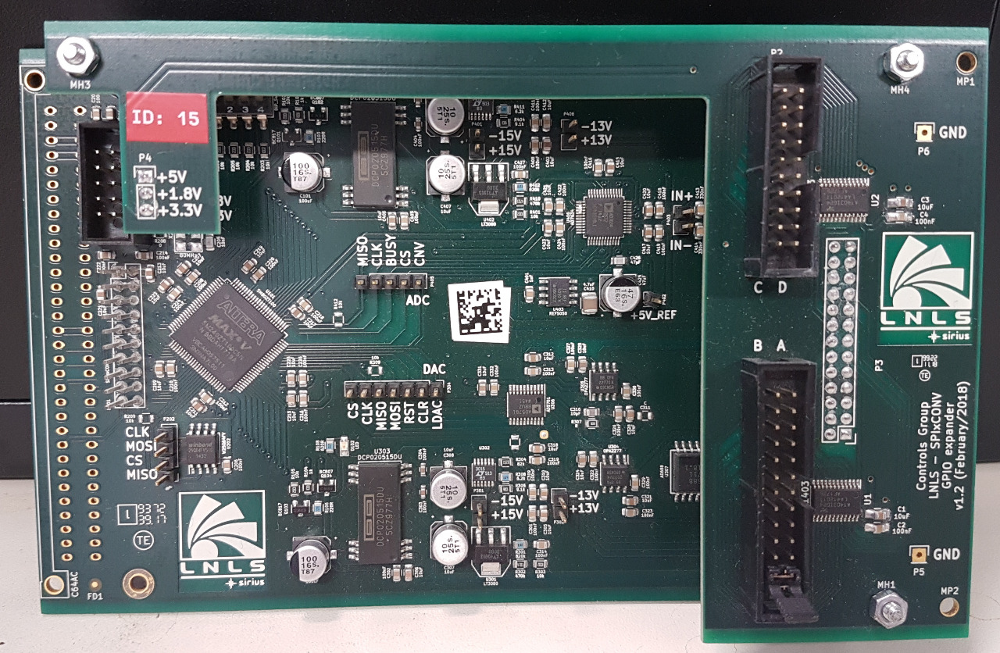
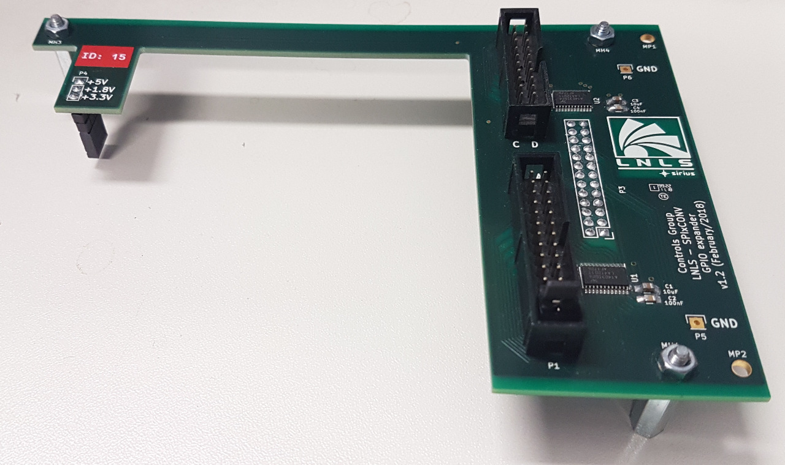
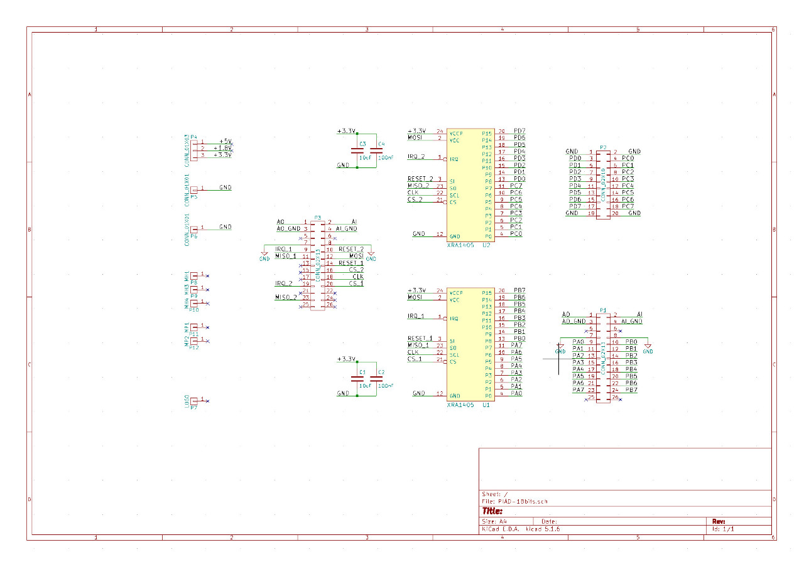
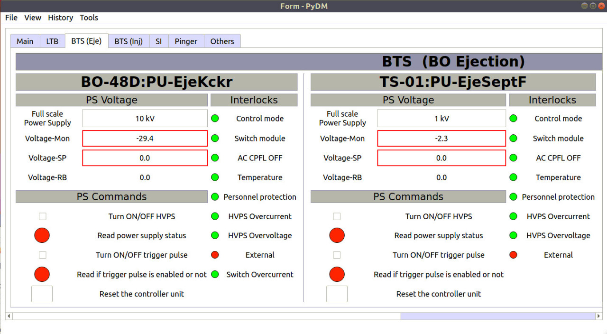

# SPIxCONV

This project consists of an 18-bit analog input (ADC) and output (DAC) within a range of 20 V (± 10 V) and 32 digital pins that can be either as inputs or outputs. This system interfaces with pulsed power electronics hardware in order to control the output voltage for pulsed magnets as well as read and write status commands to their power supplies. An operator interface (OPI) software based on Qt was also developed for remote control.

<!--========================================-->
## Hardware
<!--========================================-->

<!--==============================-->
### Main Board
<!--==============================-->



<!--====================-->
#### Circuit
<!--====================-->

  - Board
<p float="left">
  
   
</p>

  - CPLD
<p float="left">
  
   
</p>

  - DAC
<p float="left">
  
   
</p>

  - ADC
<p float="left">
  
   
</p>

  - Digital I/O
<p float="left">
  
   
</p>

<!--====================-->
#### PCB
<!--====================-->

<p float="left">
   
  
</p>

<!--====================-->
#### Connectors
<!--====================-->

  - SPIxxCON
<p float="left">
   
  
</p>

  - CPLD
<p float="left">
   
  
</p>

  - Board Connection Link
<p float="left">
   
  
  
</p>

<!--====================-->
#### Test Points
<!--====================-->

  - SPI
<p float="left">
  
</p>

  - Power Voltage
<p float="left">
  
</p>

  - Analog In/Out
<p float="left">
  
</p>

<!--====================-->
#### BOM
<!--====================-->
Bill of materials

<!--==============================-->
### GPIO Expander Board
<!--==============================-->



<!--====================-->
#### Circuit
<!--====================-->


<!--====================-->
#### PCB
<!--====================-->
<p float="left">
   
  
</p>

<!--====================-->
#### Connectors
<!--====================-->

  - Interface A/B
<p float="left">
   
  
</p>

  - Interface C/D
<p float="left">
   
  
</p>

<!--====================-->
#### Test Points
<!--====================-->

  - Power Voltage
<p float="left">
  
</p>

  - Analog In/Out
<p float="left">
  
</p>

<!--====================-->
#### BOM
<!--====================-->
Bill of materials

<!--====================-->
### Identification
<!--====================-->
<p float="left">
   
  
</p>

<!--========================================-->
### Software
<!--========================================-->

The software files of this project related to the server-side (IOC) is now available at [streamdevice-ioc](https://github.com/lnls-sirius/streamdevice-ioc) GitHub's repository under the "spixconv" directory.

The software files related to the OPI (Operator Interface) is now at [pydm-opi](https://github.com/lnls-sirius/pydm-opi) GitHub's repository.

Finally, the client-side (Python code) is at this repository under the [scripts](https://github.com/lnls-sirius/SPIxCONV/tree/master/software/scripts) directory.

<!--====================-->
#### Brief Description
<!--====================-->
To remotely control the board an [EPICS](https://epics-controls.org/about-epics/) IOC with an OPI was developed.

The IOC was built using [asynDriver](https://epics.anl.gov/modules/soft/asyn/) and [StreamDevice](http://epics.web.psi.ch/software/streamdevice/) on top of it. The application is launched in a form of a Docker container. The Docker image can be found at [Docker Hub](https://hub.docker.com/repository/docker/lnlscon/streamdevice-ioc) with the tag "SPIxCONV" followed by the version (eg: SPIxCONV-v1.9.6).

To configure the parameters of the IOC a [spreadsheet](https://cnpemcamp.sharepoint.com/:x:/s/controle/EUG0_4JUaz9Au7kZNcMZwZQB1x5OJBN_1QMdbbCGJ1Driw?e=Po8LNr) is used (available for CNPEM accounts only). PV's prefix, Power Supply voltage, host IP to connect to, scan rate and other settings can be adjusted. 

<!--====================-->
#### OPI (Operator Interface)
<!--====================-->

Previously, [Control System Studio](http://controlsystemstudio.org/) was used to develop the OPI. The windows can still be found under the [CSS](https://github.com/lnls-sirius/SPIxCONV/tree/master/software/CSS) directory. Lately, we have been using [PyDM (Python Display Manager)](https://slaclab.github.io/pydm/) to develop the windows. As stated before, the files related to the PyDM OPI is located in [pydm-opi](https://github.com/lnls-sirius/pydm-opi) repository.



<!--====================-->
#### CPLD
<!--====================-->

<p float="left">
   
  
</p>


<!--====================-->
#### Board Calibration
<!--====================-->

To achieve more confiability, a calibration is done considering the DAC adjusts and the ADC measures. The next figures show the setup for this procedure. We basically connect the DAC output to the voltmeter and to the ADC input simultaneously.

<p float="left">
   
  
</p>

  - DAC calibration:
To calibrate the DAC we set its output to -9 V and later to +9 V and measure the real output voltage with the help of a 7 ½ digit voltmeter (here we are using the [Keysight 34420A](https://github.com/lnls-sirius/SPIxCONV/blob/master/documentation/Keysight%2034420A%20datasheet.pdf). We then use both measures to calculate the angular and linear coeffients for this curve.

  - ADC calibration:
Now that we have the DAC calibrated, we will use its output to calibrate the ADC coefficients. Again, we set the DAC output to -9 V (already considering the corrections), wait 60 s for thermal stabilization and read the voltage with the ADC. We then repeat the procedure for an adjustment of +9 V on the DAC output. Finally, these measures are used to calculate an angular and linear coefficient for the ADC.

An automated script was developed for this process. To control the voltmeter 34420A remotely we need a RS-232/USB adaptor to plug it in the USB connector of the BeagleBone Black. An important thing to note, is that the serial cable (RS-232) has an identification to show which side is the voltmeter's one and which should be connected to the adaptor.

<p float="left">
   
  
</p>

Finally, to calibrate the board, just connect to the BeagleBone Black and run the appropriate scrips, as showed below:

```console
$ ssh root@<BBB-IP>
root@beaglebone:~# systemctl stop bbb-function
root@beaglebone:~# /root/spixconv/software/scripts/calibration.py <BOARD-ID>
    gain = 1.00014284735
    offset = -15.81235112
    gain = 1.00052568324
    offset = -66.6829873034
```

Where <BBB-IP> is the BeagleBone IP (for example "192.168.7.2") and the <BOARD-ID> is the identification of the board (for example "15").

| Board ID |   DAC gain    |  DAC offset   |   ADC gain    |   ADC offset   |    Date    |
| :------: | :-----------: | :-----------: | :-----------: | :------------: | :--------: |
|     1    | 1.00022856796 | -23.604551795 | 1.00031151483 | -25.5034979525 | 06/14/2018 |
|     2    | 1.00026576963 | -28.880179670 | 1.00047415222 | -60.2158137830 | 06/14/2018 |
|     3    | 1.00030796599 | -32.699603180 | 1.00041814300 | -47.9227113769 | 06/18/2018 |
|     4    | 1.00017479634 | -17.242341185 | 1.00026390485 | -31.6174014794 | 06/19/2018 |
|     5    | 1.00017265115 | -13.974728690 | 1.00045784906 | -39.5533800101 | 06/19/2018 |
|     6    | 1.00015184443 | -11.674423865 | 1.00060158655 | -59.1729212883 | 06/19/2018 |
|     7    | 1.00019784934 | -20.918896760 | 1.00029330340 | -24.4439584471 | 06/19/2018 |
|     8    | 1.00035674834 | -37.769448800 | 1.00029168671 | -34.0324363824 | 06/19/2018 |
|     9    | 1.00023135812 | -26.566767695 | 1.00045023944 | -44.5911926966 | 06/19/2018 |
|    10    | 1.00020592482 | -21.571632830 | 1.00044201352 | -51.3525871959 | 06/19/2018 |
|    11    | 1.00014897135 | -16.862233835 | 1.00067934214 | -81.2456900362 | 06/19/2018 |
|    12    | 1.00022598345 | -22.008100925 | 1.00057691743 | -66.0110325831 | 06/19/2018 |
|    13    | 1.00032333122 | -33.267142775 | 1.00039023957 | -45.3552208747 | 06/19/2018 |
|    14    | 1.00016016368 | -18.311884625 | 1.00048566801 | -60.5575726483 | 06/19/2018 |
|    15    | 1.00022607238 | -22.051354520 | 1.00046470661 | -58.5770907625 | 06/19/2018 |
|    16    | 1.00028974958 | -32.626203140 | 1.00073037347 | -97.7370251289 | 06/19/2018 |
|    17    | 1.00027075563 | -27.292903805 | 1.00037276504 | -34.2682222150 | 06/20/2018 |
|    18    | 1.00017256223 | -15.753368945 | 1.00046720927 | -66.4461854942 | 06/20/2018 |
|    19    | 1.00023103020 | -24.296609315 | 1.00032961706 | -28.7417520711 | 06/20/2018 |
|    20    | 1.00019010191 | -20.998850375 | 1.00012983616 | -2.10309904365 | 06/20/2018 |


<!--====================-->
#### Code
<!--====================-->
[https://lnls-sirius.github.io/SPIxCONV/](https://lnls-sirius.github.io/SPIxCONV/)

<!--========================================-->
### Known Problems
<!--========================================-->

  - Not connecting to IOC after BBB reboots:  
    Status: both nodes (IOC and BBB) show they are connected, but the IOC does not respond.
    Solution: reboot IOC.

  - Flash memory loses data:
    Status: this happened once in three years. After a power cycle, the flash suddenly lost al its data!
    Solution: record information in flash memory again.

<!--========================================-->
### FAQ
<!--========================================-->

